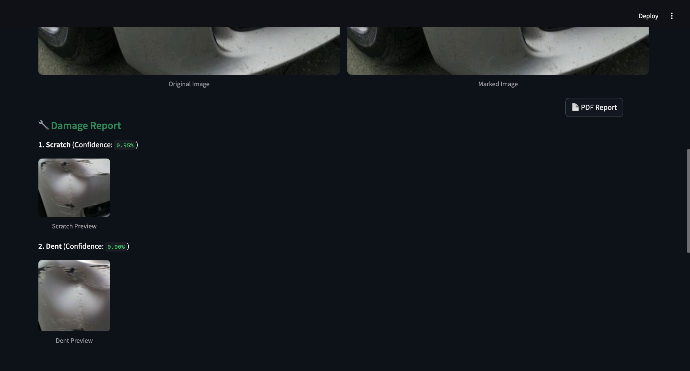

# LLM-infused Vehicle Damage Detection and Repair Cost Estimation System

## Overview

This project is an AI-powered web application that detects vehicle damage from images and estimates the repair cost using:
- Roboflow-trained segmentation model for damage detection
- Google Gemini AI for cost estimation and repair recommendations
- PDF report generation summarizing analysis and costs
- Fully Dockerized architecture (Flask + Streamlit + MySQL)

---

## Use Case

- Car owners: Self-assess vehicle damage and cost.
- Insurance companies: Streamline and automate claim processes.
- Garages/Repair shops: Generate quick, AI-based reports.
- Fleet managers: Automate routine vehicle inspections.

---

## Features

- Upload car image through a frontend Streamlit app
- Detect and segment damages (dent, scratch, crack, broken lamp, tire flat, glass shatter)
- Get manual and Gemini AI-based cost estimation (₹ INR)
- Generate a 3-page downloadable PDF report with visuals and pricing
- Automatically stores results in MySQL database
- Streamlit frontend + Flask backend + Roboflow + Gemini AI + Docker

---

## Architecture

- **Frontend**: Streamlit UI for interaction
- **Backend**: Flask API that connects damage detection & cost modules
- **Model**: Roboflow-hosted YOLOv8-seg segmentation model
- **Cost AI**: Google Gemini 1.5 Pro model via GenerativeAI SDK
- **Database**: MySQL container for storing image paths, damage data, and costs

---

## Technologies Used

| Component       | Technology                          |
|----------------|--------------------------------------|
| Frontend       | Streamlit + HTML + CSS              |
| Backend        | Python + Flask                      |
| Detection      | YOLOv8 Segmentation (Roboflow API)  |
| Cost Estimation| Google Gemini AI (via GenerativeAI) |
| PDF Export     | FPDF                                 |
| Database       | MySQL                               |
| Deployment     | Docker + Docker Compose             |

---

## Project Structure

```
vehicle-damage-detection/
│
├── backend/                 # Flask App
│   ├── app.py
│   ├── damage_utils/
│   ├── requirements.txt
│
├── frontend/                # Streamlit UI
│   ├── app.py
│   ├── requirements.txt
│
├── docker/
│   ├── Dockerfile           # Backend Dockerfile
│   ├── Dockerfile.frontend  # Frontend Dockerfile
│
├── schema.sql               # MySQL schema
├── .env                     # API Keys and DB config
├── docker-compose.yml       # Full stack orchestration
```

---

## MySQL Schema

```sql
CREATE DATABASE IF NOT EXISTS vehicle_damage;
USE vehicle_damage;

CREATE TABLE IF NOT EXISTS damage_reports (
    id INT AUTO_INCREMENT PRIMARY KEY,
    image_path VARCHAR(255) NOT NULL,
    damage_result TEXT NOT NULL,
    cost_estimation VARCHAR(100) NOT NULL,
    created_at TIMESTAMP DEFAULT CURRENT_TIMESTAMP
);
```

---

## Screenshots

### 1. Landing Page


### 2. Upload + Detect


### 3. Detected Marked Image


### 4. Cropped Previews


### 5. Generated PDF


### 6. Gemini Estimate


---

## How to Run the Project (Manual)

### Backend (Flask):

```bash
cd backend
pip install -r requirements.txt
python app.py
```

### Frontend (Streamlit):

```bash
cd frontend
pip install -r requirements.txt
streamlit run app.py
```

---

## Dockerized Setup (Recommended)

```bash
# Build and run the entire stack
docker-compose up --build
```

Access:
- Streamlit UI → http://localhost:8501
- Flask API → http://localhost:5050

---

## SDG Goals Alignment

- SDG 3 – Good Health and Well-Being
- SDG 9 – Industry, Innovation, and Infrastructure
- SDG 11 – Sustainable Cities and Communities
- SDG 12 – Responsible Consumption and Production
- SDG 13 – Climate Action

---

## Credits

- Roboflow (Model Training & Hosting)
- Google Generative AI (Gemini)
- Streamlit
- Flask
- FPDF

## Roboflow Trained Model

https://app.roboflow.com/seai-sq6is/car-paint-damage-detection-qwpiw/models/car-paint-damage-detection-qwpiw/1

## Author

Tharanikkumar K
https://github.com/tharanikkumar
